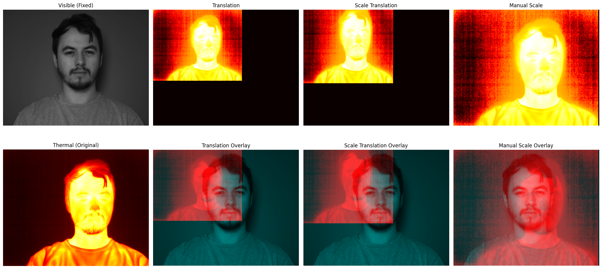
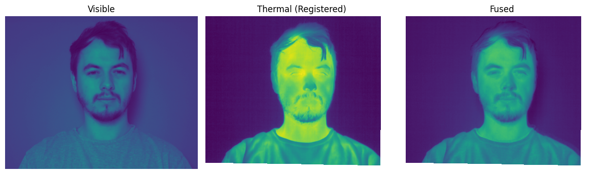
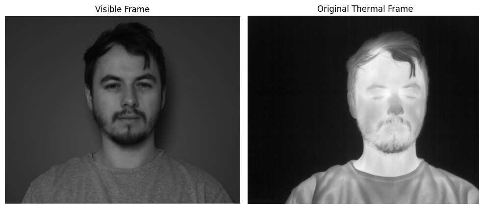
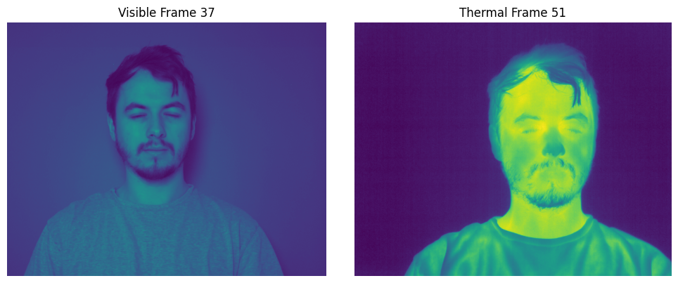
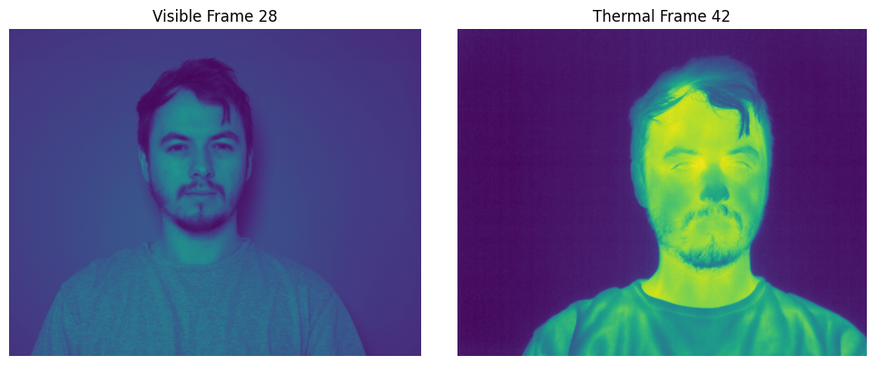

# Multimodal Image Fusion for Facial Analysis

This repository provides tools and algorithms for **image registration** and **multimodal image fusion**, using RGB and thermal facial images. It is designed for medical applications such as **remote photoplethysmography (rPPG)** and **facial skin anomaly detection**.



## Table of Contents
- [Overview](#overview)
- [Highlights](#highlights)
- [Repository Structure](#repository-structure)
- [Installation](#installation)
- [Image Registration](#image-registration)
- [Temporal Mismatch and Alignment of RGB and Thermal Images](#temporal-mismatch-and-alignment-of-RGB-and-Thermal-Images)


## Overview
This project implements image registration techniques to enable multimodal image fusion of **facial RGB and thermal image** data. It supports medical analysis by combining RGB and thermal imaging modalities and aligning them temporally. This repository implements three methods to register **facial RGB and thermal images** and align them temporally using timestamp differences:
1. **Enhanced Correlation Coefficient (ECC)**:
    - Robust alignment for global motion  
    - Fusion step is non-adaptive
2. **SimpleITK Registration Framework**
    - High-precision multimodal image registration
3. **Deep Learning-based Multimodal Image Fusion**
    - (In progress)
   
## Highlights
- **Multimodal Image Fusion**: Combines RGB and thermal images using ECC (OpenCV) and SimpleITK for enhanced feature extraction.
- **Temporal Alignment**: Matches RGB and thermal images across time frames using timestamp-based temporal difference calculations.
- **Evaluation Metrics**: Includes the **Structural Similarity Index (SSIM)** metric to evaluate the quality of image alignment and fusion.
- **Medical Applications**: Supports rPPG (e.g., heart rate extraction) and skin anomaly detection in facial image data.


## Repository Structure
```
├── RGB_thermal_Fusion.ipynb          # RGB-thermal image fusion using ECC (OpenCV) and SimpleITK
├── time_stamp_matching.ipynb         # Temporal alignment of RGB and thermal images using timestamps
├── images 
└── README.md   
```

## Installation
To set up the project locally, follow these steps:

1. **Clone the repository**:
    ```bash
    git clone https://github.com/usmanraza121/Multimodal-Image-Fusion.git
    cd Multimodal-Image-Fusion
    
    ```

2. **Create a virtual environment**:
   ```bash
   conda create -n mmfusion
   conda activate mmfusion
   ```

3. **Install dependencies**:
   Install required packages:
   ```bash
   pip install numpy opencv-python scikit-image SimpleITK matplotlib
   ```


## Image Registration
This image demonstrates the **registration process**, where RGB and thermal images are aligned spatially to ensure that corresponding features (such as facial landmarks) from both modalities match accurately for further analysis.




## Temporal Mismatch and Alignment of RGB and Thermal Images
**Time-stamp mismatching example:**
This image shows the **original time indices** where the RGB and thermal images are temporally misaligned. In the RGB image (from the same time index as the thermal image), the subject’s eyes are open, while in the thermal image, the subject’s eyes are closed. This mismatch indicates a temporal misalignment between the two modalities.


**Time-stamp matching examples:**
The following images demonstrate how **temporal alignment** is applied to synchronize the RGB and thermal images. This alignment ensures that corresponding features in both modalities, such as the subject’s eyes, are properly aligned across time indices.

- **Example 1:**
  - **RGB Image Index: 37** (subject's eyes closed)
  - **Thermal Image Index: 51** (subject's eyes closed after alignment)

  After temporal alignment, both images show the subject with **eyes closed**, indicating that the correct temporal index has been matched.



*After temporal alignment: Both RGB and thermal images show the subject’s eyes closed.*


- **Example 2:**
  - **RGB Image Index: 28** (subject's eyes open)
  - **Thermal Image Index: 42** (subject's eyes open after alignment)
  
  After temporal alignment, the RGB and thermal images are synchronized, and both show the subject with **eyes open**.



*Both RGB and thermal images show the subject's eyes open.*

